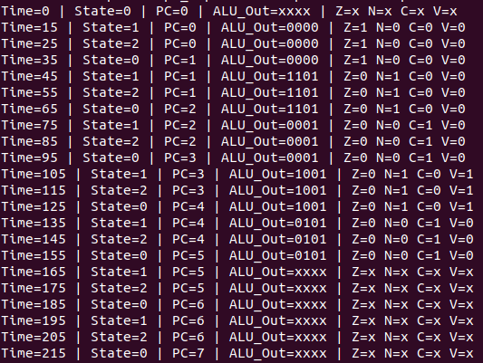
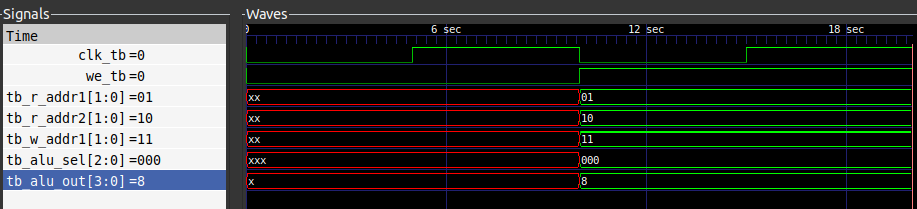
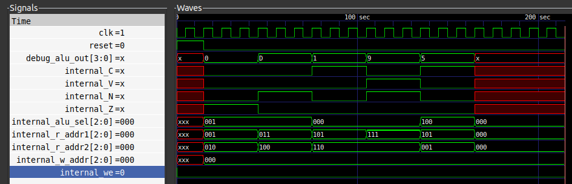
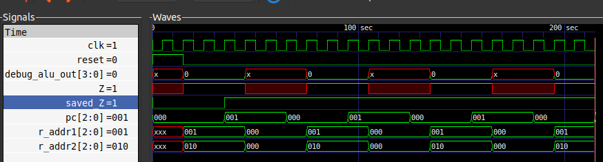

# Turing-Complete 4-Bit Custom Microarchitecture

## Overview
A fully integrated, Turing-complete 4-bit microprocessor designed in Verilog from scratch. This project evolved from a standalone parameterized datapath into a complete CPU featuring a custom FSM Control Unit, an Arithmetic Logic Unit (ALU), a multi-port Register File, and dedicated hardware hazard mitigation for control flow.

## Architectural Features

* **Custom Control Unit:** A finite state machine (FSM) responsible for instruction fetching, decoding, and execution routing across the datapath.
* **Status Register (Hazard Mitigation):** Dedicated hardware to latch ALU flags (like the Zero Flag) on the clock edge, preventing combinational wipeout during conditional branching operations.
* **Execution Core (ALU):** A purely combinational 4-bit Arithmetic Logic Unit supporting arithmetic and bitwise operations.
* **Short-Term Vault (Register File):** A parameterized memory array featuring dual synchronous combinational read ports and a single clock-guarded sequential write port.
* **Parameterized Widths:** Data and address bus widths are scalable via top-level parameter propagation.

## Instruction Set Architecture (ISA)

The CPU currently supports the following custom instruction set:

| Opcode / Type | Instruction | Description |
| :--- | :--- | :--- |
| **Arithmetic** | `ADD` | Adds the contents of two registers. |
| | `SUB` | Subtracts the contents of two registers. |
| **Bitwise** | `AND` | Performs a bitwise AND operation. |
| | `OR` | Performs a bitwise OR operation. |
| **Data Transfer**| `MOV` | Moves data between registers. |
| | `LDI` | Loads an immediate value into a register. |
| **Control Flow** | `JMP` | Unconditional jump to a target address. |
| | `JMP_Z` | Conditional jump. Jumps only if the Zero Flag is set. |

## Hardware Verification & Bug Resolution

Building a Turing-complete machine requires strict timing synchronization. During the implementation of the `JMP_Z` (Jump-if-Zero) instruction, a critical hardware glitch was discovered: the "Combinational Wipeout."

Because the ALU's Zero Flag was tied directly to the combinational output, the moment the program counter jumped, the ALU inputs changed, instantly destroying the Zero Flag before the Control Unit could finish evaluating the jump condition.

**The Fix:** A dedicated Status Register was engineered into the datapath. By latching the ALU flags on the positive edge of the clock cycle *before* the jump evaluation, the Control Unit was provided a perfectly stable, clock-synchronized flag to read from. 

### Verification Waveforms

**Standard Execution & Status Register Fix**


.png)

**Bitwise AND Verification**



**Jump-if-Zero (JMP_Z) Hazard Mitigation**



## File Structure

* `rtl/` - Contains the synthesizable Verilog modules (`cpu_top.v`, `control_unit.v`, `datapath.v`, `alu.v`, `reg_file.v`).
* `tb/` - Contains the verification testbenches (`tb_cpu.v`).
* `sim/` - Contains GTKWave dump files (`.vcd`) and waveform verification screenshots.
* `docs/` - Architecture diagrams and state transition mappings.

## Toolchain & Prerequisites
To compile and simulate this RTL, you need an EDA toolchain capable of Verilog-2001 compilation and VCD waveform viewing:
* [Icarus Verilog (iverilog)](http://iverilog.icarus.com/)
* [GTKWave](https://gtkwave.sourceforge.net/)

## How to Run the Simulation

Clone the repository and execute the compilation toolchain from your terminal:

```bash
# 1. Compile the architectural modules and testbench
iverilog -o sim_cpu rtl/*.v tb/tb_cpu.v

# 2. Execute the simulation binary
vvp sim_cpu

# 3. Open the waveform viewer
gtkwave tb_cpu.vcd
